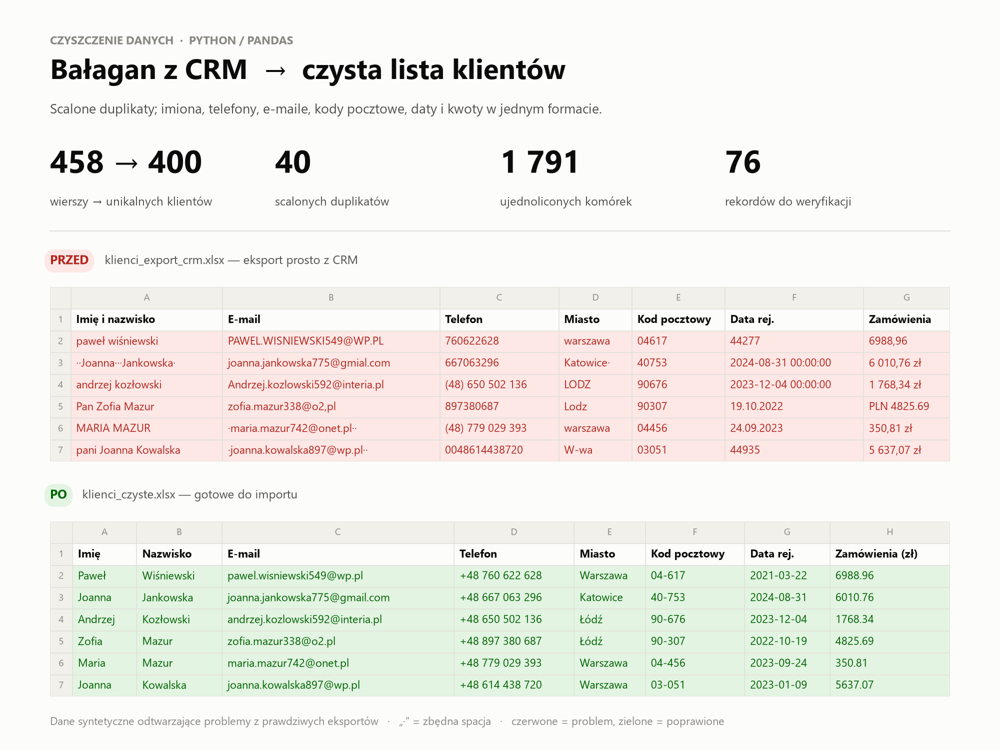

# Czyszczenie i deduplikacja bazy klientów z CRM

[English](README.md) · **Polski**

**Problem:** sklep internetowy ma eksport klientów z CRM, który przez lata był ręcznie edytowany w Excelu.
Nie da się go wgrać do systemu mailingowego ani policzyć, ilu naprawdę jest klientów: te same osoby są wpisane
kilka razy, telefony i daty są w pięciu formatach, a Excel „zjadł” zera z kodów pocztowych.

**Wynik:** z 458 wierszy zostało **400 unikalnych klientów** w jednolitym formacie i 76 rekordów
opisanych po polsku jako „do sprawdzenia”. Nic nie zostało usunięte po cichu.



## Co zostało naprawione

| Problem w danych | Przykład „przed” | „Po” | Liczba |
|---|---|---|---:|
| Puste wiersze | — | usunięte | 6 |
| Wiersze wklejone dwa razy | identyczne rekordy | usunięte | 12 |
| Ten sam klient pod różnymi ID | `K0002` `małgorzata kowalska` `…@interia,pl` i `K0413` `Małgorzata Kowalska` `…@INTERIA.PL` | jeden klient, najwcześniejsza data rejestracji, kwoty zamówień zsumowane | 40 |
| Imiona i nazwiska | `  pani ANNA   kowalska ` | `Anna` / `Kowalska` | 214 |
| Telefony | `0048123456789`, `(48) 123 456 789`, `123-456-789` | `+48 123 456 789` | 338 |
| E-maile | ` Jan.Nowak@GMIAL.com ` | `jan.nowak@gmail.com` | 130 |
| Miasta | `W-wa`, `KRAKOW`, `Lodz` | `Warszawa`, `Kraków`, `Łódź` | 205 |
| Kody pocztowe | `00950`, `950` (Excel usunął zera) | `00-950` | 192 |
| Daty | `05.03.24`, `5/3/2024`, `45356` (numer seryjny Excela) | `2024-03-05` | 431 |
| Kwoty | `1 234,50 zł`, `PLN 1.234,50` | `1234.50` (liczba) | 281 |

**Jak wykrywane są duplikaty:** dwa rekordy to ten sam klient, jeśli mają ten sam e-mail (po normalizacji)
**albo** to samo imię, nazwisko i telefon. Łączenie działa łańcuchowo (union-find), więc duplikat
z literówką w e-mailu też zostanie złapany po telefonie. Samo imię i nazwisko nie wystarcza do scalenia,
bo Anna Nowak to nie zawsze ta sama osoba.

**Kontrola jakości:** rekordy, których nie da się naprawić automatycznie, trafiają do arkusza
`do_weryfikacji` z opisem problemu, np. `nieprawidłowy e-mail: 'jan.kowalskigmail.com'` albo
`kod 80-123 nie pasuje do miasta Warszawa`.

## Pliki wynikowe

| Plik | Zawartość |
|---|---|
| [`klienci_czyste.xlsx`](data/output/klienci_czyste.xlsx) | arkusze: `klienci` · `scalone_duplikaty` · `do_weryfikacji` · `log_zmian` |
| [`raport.md`](data/output/raport.md) | podsumowanie zmian z przykładami przed/po |
| [`przed_po.png`](data/output/przed_po.png) | porównanie wizualne |

## Uruchomienie

```bash
python 01-customer-data-cleaning/generate_data.py   # tworzy "brudny" plik wejściowy
python 01-customer-data-cleaning/clean.py           # czyści i zapisuje wyniki
```

> Dane są **syntetyczne** (wygenerowane skryptem z ustalonym ziarnem losowania) i odtwarzają problemy
> spotykane w prawdziwych eksportach. Nie zawierają danych prawdziwych osób.
