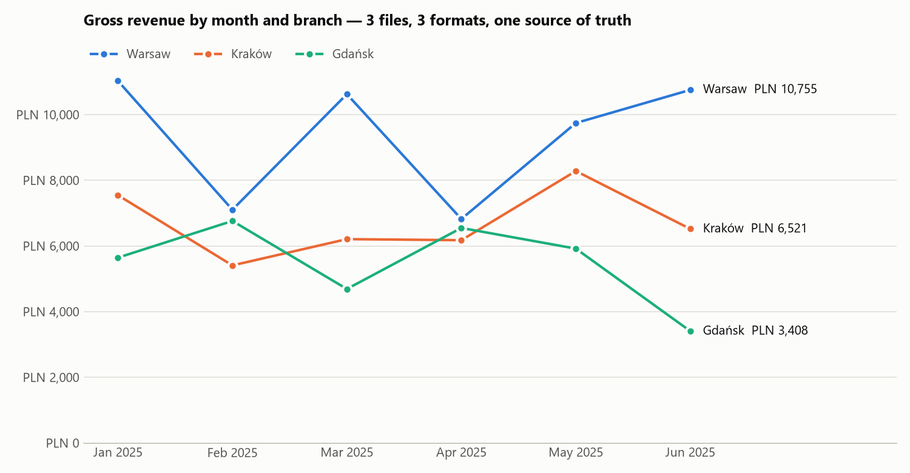

# Merging Sales Exports from 3 Branches (3 Formats) with a Product Catalog

**English** · [Polski](README.pl.md)

**The problem:** a chain of three coffee & tea shops wanted its first-half sales in one place. Each branch exports
from a different system, so the files don't fit together, and copying them into one spreadsheet by hand took hours
and introduced errors.

| Branch | File format | Traps |
|---|---|---|
| Warsaw | CSV, UTF-8, `,` separator | English column names, ISO dates, dot decimals |
| Kraków | CSV, **Windows-1250**, `;` separator | `1 234,50 zł` stored as text, `dd.mm.yyyy` dates, lower-case SKUs, a **TOTAL row** at the end |
| Gdańsk | Excel | **title and blank row above the header**, SKUs like `KAW 001` / `kaw001 `, **one week exported twice** |
| Catalog | Excel | product names, categories, list prices |

**The result:** one table of **1,200 transactions** (PLN 129,206.90 gross), enriched with product names, categories
and a discount flag. It comes with ready-made summaries and a **control sum that matches the Kraków file's own TOTAL
row to the grosz**.




## What was done

| Step | Count |
|---|---:|
| Auto-detected encoding (UTF-8 / Windows-1250) and separator | 2 CSV files |
| Auto-detected the real header row in Excel | 1 file |
| Mapped different column names to one schema (`Ilość` / `Szt.` / `quantity` → `ilosc`) | 3 files |
| Standardized SKU codes (`kaw001 `, `KAW 001` → `KAW-001`) | 347 |
| Removed the TOTAL row (kept as a control sum) | 1 |
| Removed duplicated transactions (same receipt number exported twice) | 7 |
| Transactions with products missing from the catalog: **flagged, not dropped** | 16 |
| Transactions in the final table | 1,200 |

**Control sums:** the Kraków file says TOTAL = PLN 40,147.75, and the merged data sums to PLN 40,147.75 ✔.
The client can be sure that nothing was lost or double-counted along the way.

**Questions for the client:** products `KAW-099` and `AKC-050` sell in every branch but are missing from the
catalog (sheet `brak_w_katalogu`). Instead of guessing, I raise them with the client.

## Deliverables

| File | Contents |
|---|---|
| [`raport_sprzedazy.xlsx`](data/output/raport_sprzedazy.xlsx) | sheets: data · month × branch · categories · top 10 products · not in catalog · control sums · change log |
| [`sprzedaz_polaczona.csv`](data/output/sprzedaz_polaczona.csv) | one table: `;` + decimal comma + UTF-8 BOM, so it opens cleanly in Polish Excel |
| [`raport.md`](data/output/raport.md) | text summary |
| [`monthly_sales.png`](data/output/monthly_sales.png) | revenue chart |

The client is Polish, so the delivered files keep Polish column names.

## Run it

```bash
python 02-sales-data-merge/generate_data.py   # creates the 3 branch files + catalog
python 02-sales-data-merge/merge.py           # merges, checks, reports
```

Adding a fourth branch takes one line in `merge.py`, as long as its columns can be mapped through `SCHEMA`.

> The data is **synthetic**. It was generated with a fixed random seed and reproduces problems found in real exports.
