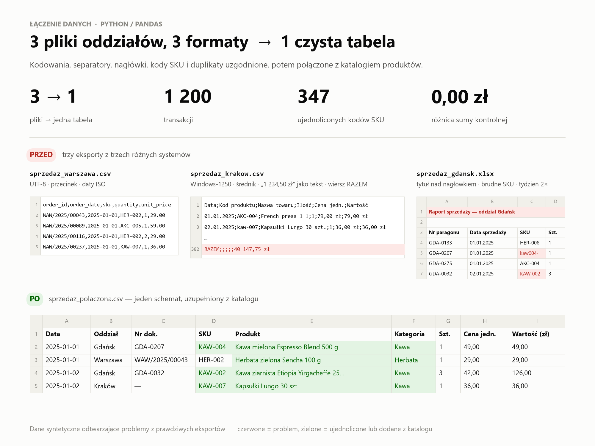
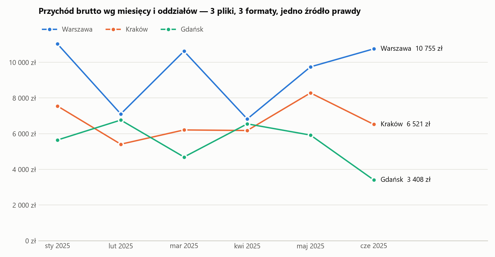

# Łączenie sprzedaży z 3 oddziałów (3 różne formaty) z katalogiem produktów

[English](README.md) · **Polski**

**Problem:** sieć 3 sklepów z kawą i herbatą chce zobaczyć sprzedaż za pierwsze półrocze w jednym miejscu.
Każdy oddział eksportuje dane z innego systemu, więc pliki nie pasują do siebie. Kopiowanie ręczne do
jednego Excela kończy się błędami i trwa godzinami.

| Oddział | Format pliku | Pułapki |
|---|---|---|
| Warszawa | CSV, UTF-8, separator `,` | angielskie nazwy kolumn, daty ISO, kropka dziesiętna |
| Kraków | CSV, **Windows-1250**, separator `;` | `1 234,50 zł` jako tekst, daty `dd.mm.rrrr`, SKU małymi literami, **wiersz RAZEM** na końcu |
| Gdańsk | Excel | **tytuł i pusty wiersz nad nagłówkiem**, SKU w stylu `KAW 001` / `kaw001 `, **tydzień wyeksportowany dwa razy** |
| Katalog | Excel | nazwy produktów, kategorie, ceny katalogowe |

**Wynik:** jedna tabela z **1200 transakcjami** (129 206,90 zł brutto), wzbogacona o nazwy, kategorie
i informację o rabacie. Do tego gotowe zestawienia i **suma kontrolna zgodna co do grosza** z wierszem
RAZEM z pliku Krakowa.





## Co zostało zrobione

| Krok | Liczba |
|---|---:|
| Automatyczne wykrycie kodowania (UTF-8 / Windows-1250) i separatora | 2 pliki CSV |
| Automatyczne wykrycie wiersza nagłówka w Excelu | 1 plik |
| Mapowanie różnych nazw kolumn na jeden schemat (`Ilość` / `Szt.` / `quantity` → `ilosc`) | 3 pliki |
| Ujednolicone kody SKU (`kaw001 `, `KAW 001` → `KAW-001`) | 347 |
| Usunięty wiersz RAZEM (użyty jako suma kontrolna) | 1 |
| Usunięte zdublowane transakcje (ten sam nr paragonu 2×) | 7 |
| Transakcje z produktami spoza katalogu, **oznaczone, nie usunięte** | 16 |
| Transakcje w pliku wynikowym | 1200 |

**Sumy kontrolne:** Kraków ma w pliku RAZEM = 40 147,75 zł, a suma po scaleniu wynosi 40 147,75 zł ✔.
Dzięki temu klient ma pewność, że przy konwersji nic nie zginęło i nic się nie zdublowało.

**Rzeczy do wyjaśnienia z klientem:** produkty `KAW-099` i `AKC-050` sprzedają się we wszystkich
oddziałach, ale nie ma ich w katalogu (arkusz `brak_w_katalogu`). Zamiast zgadywać, zgłaszam to klientowi.

## Pliki wynikowe

| Plik | Zawartość |
|---|---|
| [`raport_sprzedazy.xlsx`](data/output/raport_sprzedazy.xlsx) | `dane` · `miesiace_x_oddzialy` · `kategorie` · `top10_produktow` · `brak_w_katalogu` · `sumy_kontrolne` · `log_zmian` |
| [`sprzedaz_polaczona.csv`](data/output/sprzedaz_polaczona.csv) | jedna tabela, `;` + przecinek dziesiętny + UTF-8 BOM, więc polski Excel otwiera ją bez „krzaczków” |
| [`raport.md`](data/output/raport.md) | podsumowanie w tekście |
| [`sprzedaz_miesieczna.png`](data/output/sprzedaz_miesieczna.png) | wykres przychodu |

## Uruchomienie

```bash
python 02-sales-data-merge/generate_data.py   # tworzy 3 pliki oddziałów + katalog
python 02-sales-data-merge/merge.py           # łączy, sprawdza, raportuje
```

Dodanie czwartego oddziału to jedna linijka w `merge.py`, o ile jego kolumny da się zmapować przez `SCHEMA`.

> Dane są **syntetyczne** (wygenerowane skryptem z ustalonym ziarnem losowania) i odtwarzają problemy
> spotykane w prawdziwych eksportach.
