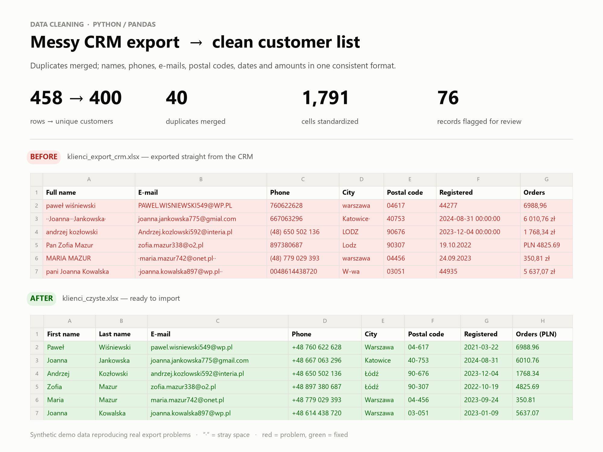
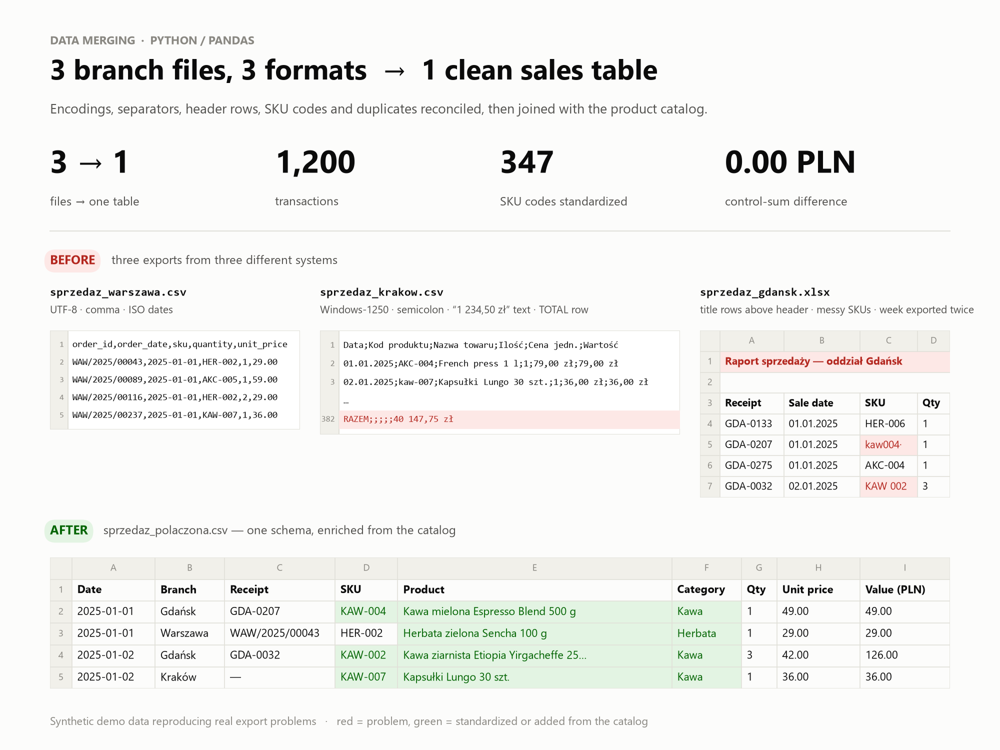

# Data Cleaning & Merging Portfolio: Excel / CSV with Python (pandas)

**English** · [Polski](README.pl.md)

I turn messy spreadsheets into clean, consistent tables that are ready for analysis, import or reporting.
That means removing duplicates, fixing formats and merging files from different systems. Every job ends with:

- **a clean Excel/CSV file** that opens correctly in the client's Excel (encoding, separators, decimals),
- **a change log** that says exactly what was fixed and how many times,
- **a list of records that need a human decision**. Nothing gets deleted silently.

## Projects

| # | Project | Input → result | Key techniques |
|---|---|---|---|
| 1 | [CRM customer database cleaning](01-customer-data-cleaning/) | 458 messy rows → **400 unique customers** | deduplication (e-mail **or** name + phone), phones, e-mails, postal codes, 6 date formats, currency text |
| 2 | [Sales merge from 3 branches](02-sales-data-merge/) | 3 files in 3 formats + catalog → **1 table, 1,200 transactions** | Windows-1250 encoding, header-row detection, column mapping, control sums, multi-sheet report |





## `datakit`: my reusable toolkit

The things every job needs live in [`datakit/`](datakit/) and are covered by **29 pytest tests**.
Each new job starts from proven functions instead of from scratch.

| Function | What it does |
|---|---|
| `normalize_phone_pl` | `0048 123-456-789` → `+48 123 456 789` |
| `normalize_email` | case, stray spaces, domain typos (`gmial.com`, `wp,pl`) |
| `normalize_postal_code_pl` | `00950` / `950` (leading zeros eaten by Excel) → `00-950` |
| `parse_mixed_dates` | `05.03.24`, `5/3/2024`, `2024-03-05`, Excel serial `45356` → one date |
| `parse_pl_number` | `1 234,50 zł`, `PLN 1.234,50`, `1,234.50` → `1234.5` |
| `link_records` | duplicate detection on several keys at once (union-find, transitive) |
| `standardize_columns` | different column names → one schema; missing column = clear error |
| `read_csv_smart` / `read_excel_smart` | auto-detect encoding, separator and the real header row |
| `write_excel_report` | multi-sheet Excel with bold frozen headers, filters and fitted column widths |
| `showcase` | spreadsheet-style before/after images, like the ones above |

## Run it

```bash
python -m venv .venv
.venv\Scripts\activate          # macOS/Linux: source .venv/bin/activate
pip install -r requirements.txt
pytest
python 01-customer-data-cleaning/generate_data.py && python 01-customer-data-cleaning/clean.py
python 02-sales-data-merge/generate_data.py && python 02-sales-data-merge/merge.py
```

> All data in this repository is **synthetic**. It was generated by the scripts with a fixed random seed
> and reproduces problems found in real exports. No real people or companies are included.
> The simulated clients are Polish, so the delivered files keep Polish column names.
